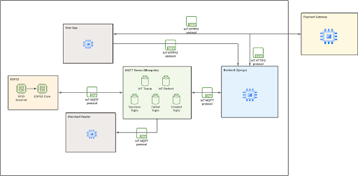

# IoTPaymentSystem

End-to-End System using IoT system for payment system development using RFID Scanner IO.

## System Functions

1. RFID Scanner with ESP32 Board on reading NFC card/tag as ID
2. LED Indicator on ESP32 on indicating payment status
3. ESP32 on sending payment request by ID
4. MQTT Broker as message transport communication protocol
5. Merchant Reader Webapp to show payment status and textual information
6. User Webapp for showing account detail and topup
7. Integration with Payment Gateway (Midtrans) for topups

## Techstack

### Hardware

-   ESP32 as main board
-   RFID Scanner for NFC Scanner (RC522) module

### Backend

-   Django-Python application
-   SQLite Database (Configurable)
-   Paho-MQTT integration

### Frontend - Merchant Reader

-   Next.js-React application
-   MQTT through websocket

### Frontend - User App

-   Next.js-React application
-   Midtrans payment gateway integration

## Architecture Overview

## Full Documentation

-   Final Report: https://docs.google.com/document/d/1r7OnJknT1NmWeZRTTwGG1tbZByLKO4WoiqGIbSavjgc
-   Technical Report: https://docs.google.com/document/d/1thT-XZ5QS8DILmi1KBX1nLI8fyUmTsYSdClJCJjmI10
